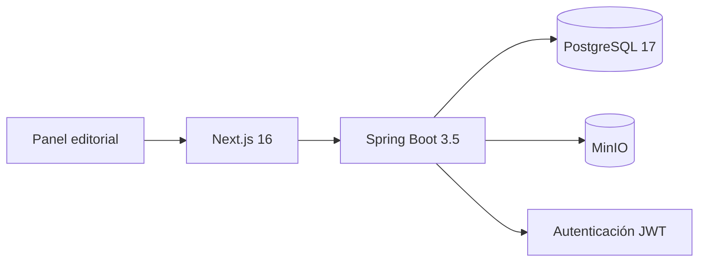

# Arquitectura

Panelium usa un monolito modular: mantiene una sola unidad desplegable, pero separa catálogo, lectura, biblioteca, seguridad, administración y medios en paquetes con responsabilidades claras.

## Backend

- `catalog`: obras, capítulos, páginas y consultas del catálogo.
- `reader`: genera el manifiesto de lectura desde PostgreSQL y MinIO.
- `library`: conserva el avance usando la identidad del JWT.
- `security`: registro, acceso, BCrypt, emisión y validación de JWT, y roles.
- `admin`: casos de uso editoriales protegidos con `ROLE_ADMIN`.
- `media`: escritura y lectura de objetos en MinIO.

Flyway gestiona el esquema. La migración V2 agrega usuarios y páginas almacenadas. El backend no mantiene sesiones: cada solicitud protegida se autentica con un token firmado.

## Frontend

Next.js usa componentes de servidor para el catálogo y componentes cliente para sesión, lector y formularios. Sus Route Handlers funcionan como una fachada para no exponer la red interna de Docker y para transmitir JSON y archivos multipart.

## Infraestructura

Docker Compose levanta PostgreSQL, MinIO, Spring Boot y Next.js. Los volúmenes conservan base de datos y objetos después de reiniciar. GitHub Actions valida Java y TypeScript en cada cambio.
